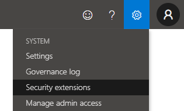
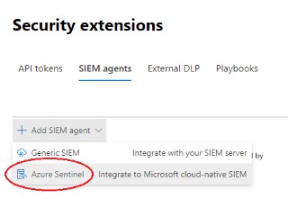

# Sentinel-Onboarding

resources for quick sentinel deployments and configurations

## Microsoft Sentinel workspace setup

1. Deploy lighthouse using the templates and the script found in the [5Q templates](https://github.com/JakeD-5Q/Sentinel-Onboarding/tree/main/Azure%20Lighthouse/5Q%20Templates) directory.

2. Create a new resource group for the Sentinel workspace
    - using naming convention:  rg-5q-sentinel

3. Deploy log analytics in the resource group just created
    - using naming convention: 5Q-LogAnalytics-Sentinel

4. Add Sentinel to the Log analytics workspace
    - using the search box or an ARM template

5. Sentinel has now been successfully deployed! The next part will be to configure this workspace for SOCaaS use.

All of these steps can be completed by using the button below. All variable values will be filled in using the Azure portal once the button has been clicked.

## Sentinel Configuration and Setup

Upon completing the initial deployment, we must add all content and connect data sources.

- [ ] Connect Azure Activity logs from the Log Analytics Workspace blade
- [ ] Turn on UEBA from the Sentinel Settings (must be global or security admin)
- [ ] Give permissions to the resource groups that hold Sentinel Playbooks

### Data connectors

I find it useful to add the data connectors that you can using the Solutions (content hub) because it does more than just connect, often it will automatically perform the steps found in the 'Next steps' tab.

Install the solution/Enable the Data connector for the following sources:

- [ ] Azure Active Directory 
  - [ ] *Check all available logs to be ingested*
- [ ] Azure Active Directory Identity Protection
-  [ ] Azure Activity 
   - [ ] *Create a remediation task*, follow the wizard's steps
- [ ] Azure Information Protection
- [ ] Microsoft Defender 365 
  - [ ] *In the [Defender console](https://security.microsoft.com/homepage), enable the 'Advanced Features'*
- [ ] Microsoft Defender for Endpoint
- [ ] Microsoft Defender for Identity
- [ ] Microsoft Defender for Office 365
- [ ] Microsoft Defender for Cloud Apps
    - [ ] *Check Cloud discovery logs*
    - [ ] In the [CloudAppSecurity portal](https://portal.cloudappsecurity.com/#/dashboard), Connect O365 and Azure
  
    - [ ] Add Microsoft Sentinel as the SIEM 
    - [ ] Go to settings (top right of page)
      - [ ] Microsoft Defender for Endpoint tab: check enforce app access
      - [ ] Check user enrichment
      - [ ] Enable Microsoft Defender for Identity data integration
      - [ ] Enable Azure AD Identity Protection alert integration
      - [ ] Enable App Governance integration
  
| Step 1 | Step 2|
--- | --- |
  |  |
Settings (Top right of page) > Security Extentions | On the page, SIEM Agents > Add SIEM agent

- [ ] Microsoft Defender Alert Evidence
- [ ] Threat & Vulnerability Management
- [ ] Office 365 
  - [ ] *Check Exchange, SharePoint, and Teams*
  
## Report Playbook

Once we have connected all of the data sources that we need, we will go to the Microsoft Sentinel's community Github repository and deploy the [M365-Security-Posture](https://github.com/Azure/Azure-Sentinel/tree/master/Playbooks/M365-Security-Posture) logic app. This playbook grabs Microsoft Defender data and ingests it into tables in the same Log Analytics workspace as Sentinel. This is a required step in our Onboarding process.

Detailed directions can be found [here](https://github.com/Azure/Azure-Sentinel/tree/master/Playbooks/M365-Security-Posture)

#### Deployment Preparation

- Create AAD app registration
- Grant it API permissions for Microsoft Graph:
  - [ ] SecurityEvents.Read.All
  - [ ] SecurityEvents.ReadWrite.All
- Grant permissions for WindowsDefenderATP (APIs my organization use)
  - [ ] Score.Read.All
  - [ ] SecurityRecommendation.Read.All
  - [ ] Vulnerability.Read.All
- Crate an app secret, record it immediately
- record the object Id and tenant Id (Overview blade)
- Grab workspace Id and the primary key from the Log Analytics workspace blade

Then deploy, using the information gathered above for the parameters.

